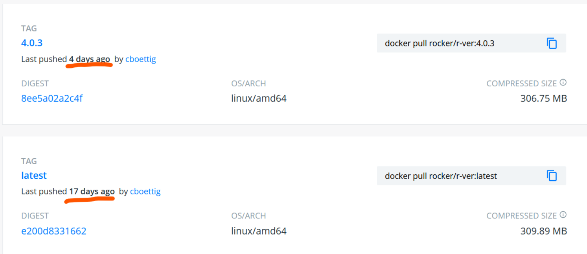

```{r xaringan-themer, include=FALSE, warning=FALSE}
library(xaringanthemer)
base_color <- "#db8400"
black_color <- darken_color(base_color, 0.9)
style_mono_accent_inverse(
  base_color = base_color,
  black_color = black_color,
  header_font_google = google_font("Noto Sans JP"),
  text_font_google = google_font("Montserrat", "300", "300i"),
  code_font_google = google_font("Fira Mono")
)
```

```{r setup, include=FALSE}
library(tibble)
library(dplyr)
library(ggplot2)
library(ggdag)
```

# 自己紹介

.center[]

- [@eitsupi](https://twitter.com/eitsupi)
- 製造業勤務
- R歴二年半くらい
  - Excelやローコードツールを触った後、ソースコードをGitで管理できることの意義を感じてRを使い始めた
- Docker歴一年半
  - WSL2バックエンドのDocker Desktop for Windowsから入った
  - Dockerを触るようになってLinuxに割と慣れた

---

# 今年やったこと
.pull-left[
1. [VS Code Remote-Containers用R定義](https://github.com/microsoft/vscode-dev-containers/tree/main/containers/r)の整備
2. [rocker/r-ver](https://hub.docker.com/r/rocker/r-ver)一族のビルドシステム大改修
  1. Dockerfileの自動更新機能追加
  2. 全ビルドをGitHub Actions上で実行
  3. タグの拡充
  4. arm64ビルドの追加
  5. レポート自動公開機能追加
3. Tokyo.RでLTを二回（※Dockerネタ）
]
--
.pull-right[


`rocker/r-ver`にPR出し過ぎてコミット数一位に……
]
---

# Docker（Linuxコンテナ）のメリット

- 環境構築かんたん
  - Dockerさえセットアップすればどのマシンでも同じように動く（多分）
  - Gitで定義ファイル（Dockerfileなど）を管理できる
- 日本語版WindowsでもShift-JISの呪いから解放される（**切実**）

---

# [rocker/r-ver](https://hub.docker.com/r/rocker/r-ver)とは？

- （後述の派生含めて）よく使われるRのコンテナイメージのひとつ
- GitHubリポジトリは[rocker-org/rocker-versioned2](https://github.com/rocker-org/rocker-versioned2)
- **再現性の重視が特徴**で、特定の日付のCRANのスナップショットからパッケージをインストールする
  - 参考：https://journal.r-project.org/archive/2017/RJ-2017-065/index.html
- Docker Official Images [r-base](https://hub.docker.com/_/r-base)と比較すると表のような差異
  - なお[r-base](https://hub.docker.com/_/r-base)のソースコードは[rocker/r-base](https://hub.docker.com/r/rocker/r-base)と同じ

```{r, echo=FALSE}
df_about_rver <- tibble::tribble(
  ~観点, ~"r-base", ~"rocker/r-ver",
  "ベースイメージ", "debian:testing", "ubuntu:latest",
  "Rパッケージリポジトリ", "CRAN", "RStudio Public Package Managerの<br>CRANミラー",
  "CPUアーキテクチャ", "amd64, arm64,<br>ppc64le, s390x", "amd64, arm64<br>（最近arm64を追加）"
)

df_about_rver |>
  knitr::kable("html", escape = FALSE)
```

---

# rocker/r-ver一族
.pull-left[
RStudio Serverをインストールした[rocker/rstudio](https://hub.docker.com/r/rocker/rstudio)、  
その上にtidyverseパッケージをインストールした[rocker/tidyverse](https://hub.docker.com/r/rocker/tidyverse)など、  
Rockerプロジェクト内だけでも多くのイメージに派生
]

--

.pull-right[
```{r dag, cache=TRUE, echo=FALSE, dev="svg"}
set.seed(1)
ggdag::dag('
  "r-ver" -> rstudio -> tidyverse -> verse -> geospatial -> binder
  "r-ver" -> shiny -> "shiny-verse"
  "r-ver" -> cuda -> ml -> mlverse
  "cuda11.1" -> "ml11.1" -> "mlverse11.1"
') |>
  tidy_dagitty() |>
  ggplot(aes(x, y, xend = xend, yend = yend)) +
  theme_xaringan() +
  geom_dag_point(color = base_color, size = 20) +
  geom_dag_edges(edge_color = base_color) +
  geom_dag_text(size = 7) +
  theme(
    panel.grid = element_blank(),
    axis.text = element_blank(),
    axis.title = element_blank(),
    axis.ticks = element_blank(),
    legend.position = "none"
  )
```
]

---

ところで、RやRStudioの新バージョンがリリースされたらすぐに試したくなりませんか？

--

「`latest`タグを指定していれば最新のバージョンをダウンロードできるでしょｗ」

```shell
docker pull rocker/r-ver:latest
```

--

現実 https://github.com/rocker-org/rocker-versioned2/issues/125

.center[]

--

`latest`は最新ではない？？？？  
（なおR 4.0.4リリースの5日後なので`latest`は`4.0.4`であることを期待していた）

---

  # 当時のビルドシステムの問題点

--

- 手動更新しているので**新バージョンのリリースは遅い**  
  （最新のRやRStudioをすぐに使えない！）

--

- メンテナがローカルでビルドしたイメージをpushしている場合もあり、  
  **GitHub上のソースコードとイメージの対応は不透明**  
  （透明性のないイメージを使うのは避けたい。。。）

--

- GitHub Actionsでビルドされた場合には`latest`タグはプッシュされないため  
  **最新イメージと`latest`イメージはズレている**  
  （何を信用したら良いのか？）

--

⇒ 改善したいと思い立ち、「**Dockerfileの自動更新**」と  
　 「**GitHub ActionsによるDockerイメージのビルド**」について検討しはじめた。

---

# Dockerfileを自動更新したい！

Dockerfileに含まれる変数（ソフトウェアのバージョン指定など）を自動取得する必要あり

--

1. **R**のバージョン
2. **RStudio Server**のバージョン
3. **Ubuntu**のバージョン
4. RStduio Public Package ManagerのCRANミラーの**URL**

--

⇒ 便利なRパッケージ（`{rversions}`、`{httr}`、`{gert}`、`{pak}`）により  
　 Rスクリプトで解決！

--

⇒ GitHub ActionsでRスクリプトを定期実行させれば自動更新システム完成！

---

# GitHub ActionsでDockerビルドしたい！

--

[docker/build-push-action](https://github.com/docker/build-push-action)で簡単に設定可能！

--

⇒ 書いてはみたものの、ワークフロー定義が長く複雑になりすぎて挫折。。。  
（あと「ビルドはローカルでも実行できるようにしたい」と言われた、その通りです）  
https://github.com/rocker-org/rocker-versioned2/pull/179

--

とにかくビルド対象のイメージが多過ぎる（たくさん×Rのバージョン毎、100以上）

---

# docker buildx bakeコマンドと<br>docker-bake.json

調べる内に、`docker buildx bake`を使うと、  
ビルドオプションを**docker-bake.hcl**や**docker-bake.json**として書けて  
コマンド一発で大量のイメージに大量のオプションを付けてビルドできることを知る

--

- 複数のタグ指定（`4.1.2`、`4.1`、`4`、`latest`を一度に付与可能）
- 複数のプラットフォーム指定（`amd64`と`arm64`のマルチアーキテクチャビルド）
- 等々……

--

⇒ jsonならRで扱えるし、Dockerfileと一緒に**docker-bake.json**も自動生成すれば  
　 単純なコマンドで思い通りのビルドができる！

---

# ……docker-bake.json???

--

- docker-bake.jsonなるファイルは**今まで一度も見たことない**  
  ググっても公式ドキュメント（[buildxのGitHubリポジトリ](https://github.com/docker/buildx)）しか見つからない……

--

- `buildx bake`コマンドは指定されたすべてのターゲットを同時にビルドするため  
  コマンド一発では**依存関係のあるイメージを順番にビルドできない**（※buildx 0.7.1時点）

--

**jq**を使いdocker-bake.json内のターゲットを順番に`build bake`に渡すことで  
1つずつ順番にターゲットをビルドする処理を**Makefile**で作成

--

⇒ ローカルでもコマンド一つで実行可能、GitHub Actionsのワークフロー定義も単純化できた

---

# ビルドレポートの自動作成

「新パッケージを追加したときとかに変更内容追えるようにしないとまずいよね」  
という考えの元、イメージの内容を記録するレポートの自動発行機能を検討

--

[Jupyter Docker Stacks](https://github.com/jupyter/docker-stacks)の行っているGitHub wikiへのレポート登録を参考にしつつ、  
せっかくRなのでRMarkdownを活用することに  
（Jupyter Docker Stacksではリポジトリ内のPythonモジュールを使用）

--

1. docker-bake.jsonに書かれたタグを全部pullする
2. pullした全イメージに対して各種コマンドを実行して情報をファイルに吐かせる
3. 吐かせた情報の書き込まれたファイルをRMarkdown上で読んでデータ処理
4. Markdownファイルとして出力、レポート完成、wikiに登録

--

というジョブを**Makefile**で定義してやり、GitHub Actions上で実行して完成！

--

このシステムの動き出したR 4.1.0リリース日以降のイメージはwikiから探せるはず……  
https://github.com/rocker-org/rocker-versioned2/wiki

---

# 最新の成果

- R 4.1.2リリース当日11月1日に`rocker/r-ver:4.1.2`公開
  - 定義ファイルを更新するPullRequestがGitHub Actionsにより自動作成された  
  https://github.com/rocker-org/rocker-versioned2/pull/278
  - ビルドされたイメージのレポート（amd64とarm64があることを明記）  
  https://github.com/rocker-org/rocker-versioned2/wiki/r-ver_e90e4d47eb34

---

# まとめ

- Rで色々作って楽しかった
  - 様々なRパッケージに触れられた
  - RMarkdownによる定型レポート作成の手軽さ・強力さを実感した
- 色々自動化して楽しかった
  - GitHub Actionsすごい
  - makeすごい
  - jqすごい

--

やろうと思っていたビルドシステムの改善は実現できたので、後はシステムが動き続けるのを見守りたいと思います

--

（RStudioのバージョン名変更とURL変更により直近二回のアップデート連敗）

--

（12月2日にRStudio Public Package Manager止まって予期せぬ動作発生）

--

<div style="text-align: right; font-weight: bold"> Enjoy! </div>
