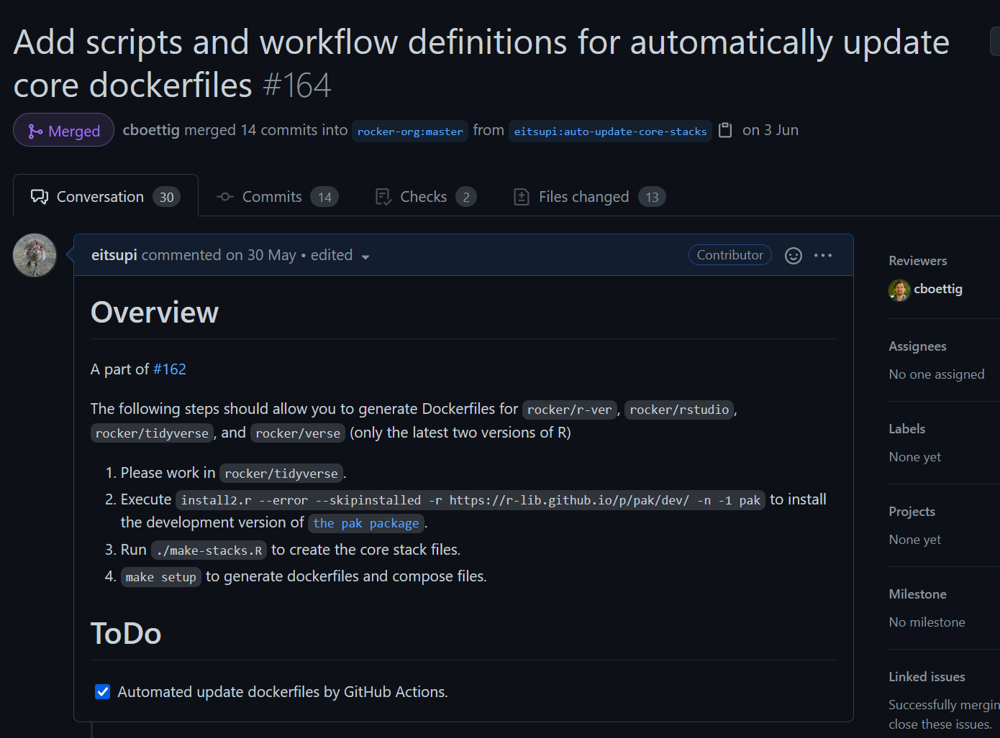

```{r xaringan-themer, include=FALSE, warning=FALSE}
library(xaringanthemer)
style_mono_accent_inverse(
  base_color = "#3C989E",
  header_font_google = google_font("Josefin Sans"),
  text_font_google = google_font("Montserrat", "300", "300i"),
  code_font_google = google_font("Fira Mono")
)
```

# [@eitsupi](https://twitter.com/eitsupi)

.center[]

- R歴二年くらい
- Docker歴一年くらい

---

# Docker（Linuxコンテナ）を使うメリット

- 環境構築かんたん。
  - Dockerさえセットアップすればどのマシンでも同じように動く。多分。
  - 破棄も簡単。ライブラリの依存関係が壊れたらコンテナを捨てるだけ。
- 日本語版WindowsでもShift-JISの呪いから解放される。重要。

---

# rocker/r-verとは？

- （後述の派生含めて）よく使われるRのコンテナイメージのひとつ
- GitHubリポジトリは[rocker-org/rocker-versioned2](https://github.com/rocker-org/rocker-versioned2)
- Docker Official Imagesの[r-base](https://hub.docker.com/_/r-base)との比較

```{r, echo=FALSE}
tibble::tribble(
  ~観点, ~"r-base", ~"rocker/r-ver",
  "ベースイメージ", "Debian", "Ubuntu",
  "Rパッケージ", "ソースインストール（遅い）", "バイナリインストール（速い）",
  "Rパッケージ固定", "なし", "あり（後述）",
  "RStudio", "なし", "rocker/rstudio",
  "アーキテクチャ", "色々", "amd64のみ"
) |>
  knitr::kable("html")
```

---

# rocker/r-verのレシピ

`rocker/r-ver`は再現性を重視しており、古いバージョンのRのイメージでは「そのバージョンのRが最新だった時代のパッケージをインストールする」という挙動をとる。

これはほぼ毎日CRANのミラーを取得しているRSPM（R3.6.3以前はMRAN）の特定の日付のミラーをCRANとして使用することで実現している。

READMEに書かれているように、だいたい以下のようなルールでDockefileが作られている。

1. そのバージョンのRがリリースされた時点で最新のUbuntu LTSをベースにする。
2. そのバージョンのRが最新だった最後の日のRSPMのCRANミラーをデフォルトのRパッケージリポジトリにする。
3. （明言されていないが）RStudioもそのバージョンのRが最新だったときの最新バージョンで固定する。

---

# 問題

- RやRStudioのリリース時に手作業でDockefileのアップデートやイメージのビルドを行っているため最新バージョンをすぐに試せない
- 手動編集による変数の設定ミス多発（CRANのスナップショットが本来の日付の一年前だったり……）

---

# 自動化したい！

誰が設定しても同じ値になるようなレシピなのだから自動化できるはず！

---

# Rのリリース日

`rversions::r_versions`関数によりRのSVNリポジトリ <https://svn.r-project.org/R/tags/> から良い感じに取得可能（よく分かってません……）

```{r}
rversions::r_versions() |>
  tail()
```

---

# Ubuntu LTSのリリース日

Ubuntuがローカルに持っているcsvファイルから取得可能

```{r}
read.csv("/usr/share/distro-info/ubuntu.csv") |>
  dplyr::select(version, series, release, eol, eol.esm) |>
  tail()
```

---

# CRANミラー

Rのリリース日とUbuntuのコードネームで生成 |> `pak::repo_ping`関数で有効性確認

```{r}
"https://packagemanager.rstudio.com/cran/__linux__/focal/2021-05-17" |>
  (function(x) pak::repo_ping(cran_mirror = x, bioc = FALSE))()
```

---

# RStudio Serverのリリース日

Gitのタグの情報をGitHub APIで取得 |> タグの打たれているコミットの日付を取得

```{r, cache=TRUE, eval=TRUE}
httr::GET(
  "https://api.github.com/repos/rstudio/rstudio/tags",
  httr::add_headers(accept = "application/vnd.github.v3+json"),
  query = list(per_page = 5)
) |>
  httr::content() |>
  (function(x) data.frame(version = purrr::map_chr(x, "name")))()
```

---

# RStudio Serverのリリース日

Gitのタグの情報をGitHub APIで取得 |> タグの打たれているコミットの日付を取得

```{r, cache=TRUE, eval=TRUE}
"https://api.github.com/repos/rstudio/rstudio/commits/df86b69ebdf62f1a9ed51af59c168572677541f1" |>
  httr::GET(httr::add_headers(accept = "application/vnd.github.v3+json")) |>
  httr::content() |>
  purrr::pluck("commit", "committer", "date") |>
  as.Date()
```

---

# これらの処理をGitHubActionsで定期実行させ自動PR作成！

```yaml
jobs:
  createPullRequest:
    container:
      image: rocker/tidyverse:latest
    steps:
      - uses: actions/checkout@v2
      - run: install2.r --error --skipinstalled -r https://r-lib.github.io/p/pak/dev/ -n -1 pak
      - run: ./make-stacks.R
      - name: Create Pull Request
        uses: peter-evans/create-pull-request@v3
        with:
          commit-message: Automatic update of container definition files
          branch: auto-detected-updates
          delete-branch: true
          title: 'Automatic update of container definition files'
          body: |
            - Auto-generated by [create-pull-request][1]
            [1]: https://github.com/peter-evans/create-pull-request
```

---

# [マージされました](https://github.com/rocker-org/rocker-versioned2/pull/164)

.center[]

---

# まとめ

- 使ったことのないパッケージのことを色々知ることができた。作者の皆様に感謝。
- GitHubActionsすごい。
- 自動化楽しい。
